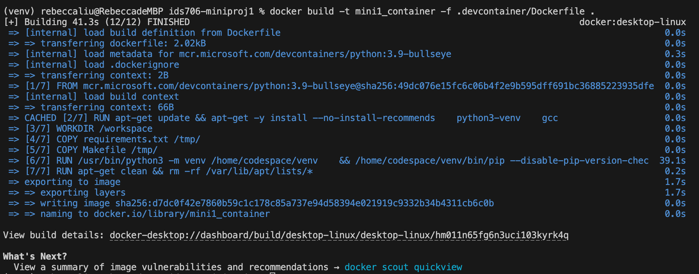

# IDS706 Create Python Template

[](https://gitlab.com/kl478/ids706-miniproj1/-/commits/main)

This repository contains a Python project skeleton following best practices for consistency, portability, and isolation in development environments. It includes the necessary files to set up a development container, Makefile for essential tasks, and a functioning CI/CD pipeline.

---

### Deliverables:
- Docker build command


- **Version Control Repository**: The project is hosted publicly at [GitLab - IDS706 Mini Project 1](https://gitlab.com/kl478/ids706-miniproj1).
- **CI/CD Pipeline**: The CI/CD pipeline is functional, and the latest run can be viewed at [GitLab CI/CD Pipelines](https://gitlab.com/kl478/ids706-miniproj1/-/pipelines).

## Project Overview

### Key Components:
- **.devcontainer**: Contains configuration files (`devcontainer.json` and `Dockerfile`) for setting up a consistent, isolated development environment using Visual Studio Code and Docker.
- **Makefile**: Facilitates common development tasks such as environment setup, testing, and linting through simple command-line entries.
- **CI/CD**: The continuous integration/continuous deployment pipeline is defined in the `.gitlab-ci.yml` file. It automates the setup, linting, and testing phases for each commit using GitLab CI/CD, ensuring that code quality is maintained consistently.
- **README.md**: Provides detailed instructions for setting up, using, and contributing to the project.

### Requirements:
- Python 3.9+
- Docker (for the development container setup)
- Git (for version control)

## Project Setup Instructions

To set up the project and start development, follow these steps:

### 1. Clone the Repository

Clone the repository to your local machine:

```bash
git clone https://gitlab.com/kl478/ids706-miniproj1.git
cd ids706-miniproj1
```

### 2. Set Up Virtual Environment (Optional for Local Development)

If you're working locally without Docker, create and activate a virtual environment for dependency management:

```bash
python3 -m venv venv
source venv/bin/activate
```

### 3. Install Required Packages

Install the dependencies listed in `requirements.txt`:

```bash
pip install --upgrade pip
pip install -r requirements.txt
```

### 4. Build the Docker Image

To create the development container using Docker, run the following command:

```bash
docker build -t mini1_container -f .devcontainer/Dockerfile .
```

This will build the Docker image using the `Dockerfile` located in the `.devcontainer` directory.

### 5. Run the Docker Container

After building the image, run the container using the following command:

```bash
docker run -it mini1_container
```

This will start the container interactively, and you can now use the container as your development environment.

## Usage Instructions

### Running the Application in the Docker Container

Once inside the Docker container, you can execute your Python scripts or run tests. For example, to run the `cli.py` script:

```bash
python src/cli.py
```

To run tests inside the container:

```bash
pytest tests/
```

### Running Locally Without Docker (Optional)

If you're not using Docker, after setting up the virtual environment and installing the dependencies, you can run the application or tests using the same commands:

```bash
python src/cli.py
pytest tests/
```

### Linting Code

To lint your code using `flake8` (or any configured linter), run the following command inside the Docker container or locally (if you’ve set up the environment):

```bash
make lint
```

### Formatting Code

To format your code using `black`, you can run:

```bash
make format
```

### Cleaning the Environment

If you need to clean up the environment (e.g., remove the virtual environment):

```bash
make clean
```

## CI/CD Pipeline Setup on GitLab

This project uses GitLab CI/CD for automated testing and linting. The CI/CD pipeline is defined in the `.gitlab-ci.yml` file, running in three stages: `setup`, `lint`, and `test`.

### Steps to Set Up CI/CD on GitLab

1. **Ensure `.gitlab-ci.yml` is in Your Repository**: It should be in the root directory of the project.
2. **Push Your Changes to GitLab**: 

```bash
git add .gitlab-ci.yml
git commit -m "Add GitLab CI/CD pipeline configuration"
git push origin main
```

3. **View Pipeline Status**: Navigate to **CI/CD > Pipelines** in GitLab to view the status of the pipeline runs.

## Development Container Setup

This project is configured with a `.devcontainer` setup for a pre-configured development environment.

### Setting up the Development Container

1. **Ensure Docker is Running**: Docker must be installed and running on your machine.
2. **Open in VSCode**: 
   - In VSCode, open the command palette (Cmd/Ctrl + Shift + P), and select `Remote-Containers: Reopen in Container`. The development container will start with all dependencies pre-installed.