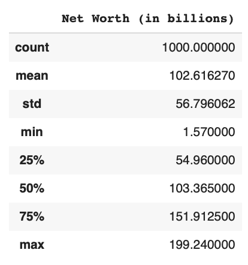
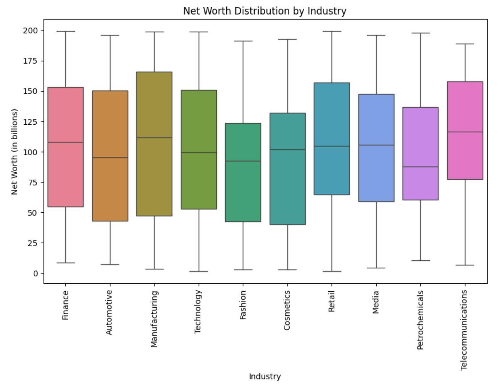

# IDS706 Individual Project #1: Continuous Integration using Gitlab Actions of Python Data Science Project

## Continuous Integration with GitHub Actions
[](https://github.com/Reby0217/ids706-indvidual1/actions/workflows/install.yml)
[](https://github.com/Reby0217/ids706-indvidual1/actions/workflows/lint.yml)
[](https://github.com/Reby0217/ids706-indvidual1/actions/workflows/format.yml)
[](https://github.com/Reby0217/ids706-indvidual1/actions/workflows/test.yml)

This project demonstrates the implementation of Continuous Integration (CI) using GitHub Actions for a Python-based Data Science project. It focuses on automating testing, code formatting, linting, and dependency management. The project performs descriptive statistics analysis using a dataset of the 1000 wealthiest people globally.

---


## Project Structure

- **Jupyter Notebook** (`src/individual_proj_1.ipynb`):
  - Performs descriptive statistical analysis using Pandas.
  - Tested using the `nbval` plugin for `pytest`.
  
- **Python Script** (`src/cli.py`):
  - Reads the dataset, computes descriptive statistics, and groups the data by industry.
  
- **Shared Library** (`src/lib.py`):
  - Contains reusable functions for data validation, reading data, calculating descriptive statistics, plotting, and calculating skewness/kurtosis.

- **Test Scripts**:
  - `tests/test_lib.py`: Contains unit tests for the shared library functions.
  - `tests/test_script.py`: Contains tests for the CLI functions.
  
- **Dataset** (`src/Top_1000_wealthiest_people.csv`):
  - A CSV file containing data about the 1000 wealthiest people, including their name, country, industry, net worth (in billions), and company.
  - **Dataset source**: [Top 1000 Wealthiest People in the World - Kaggle](https://www.kaggle.com/datasets/muhammadehsan02/top-1000-wealthiest-people-in-the-world)


## Makefile

The project uses a `Makefile` to streamline development tasks, including testing, formatting, linting, and installing dependencies. Key Makefile commands:

- **Test**: Runs tests for the notebook, script, and library.
  ```bash
  make test
  ```
  
- **Format**: Formats all Python files using `black`.
  ```bash
  make format
  ```

- **Lint**: Checks the code quality using `Ruff`.
  ```bash
  make lint
  ```

- **Install**: Installs all required dependencies from `requirements.txt`.
  ```bash
  make install
  ```

- **All**: Runs all major tasks (`install`, `setup`, `lint`, `test`, and `format`) in one command.
  ```bash
  make all
  ```

## Getting Started

### Prerequisites

- Python 3.9+
- `pip` for managing dependencies

### Installation

1. Clone the repository:

   ```bash
   git clone https://github.com/Reby0217/ids706-indvidual1.git
   cd ids706-indvidual1
   ```

2. Create and activate a virtual environment:

   ```bash
   python3 -m venv venv
   source venv/bin/activate 
   ```

3. Install dependencies:

   ```bash
   make install
   ```

### Running Tests

To run all tests (for both the notebook and the scripts):

```bash
make test
```

### Linting and Formatting

To format the code using `black`, run:

```bash
make format
```

To lint the code using `Ruff`, run:

```bash
make lint
```

### Data Sample


### Descriptive Statistics



### Bar Plot: Average Net Worth by Industry


### Box Plot: Net Worth Distribution by Industry
