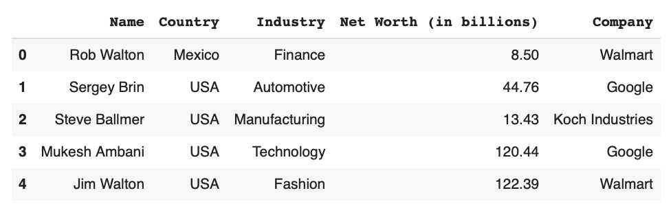
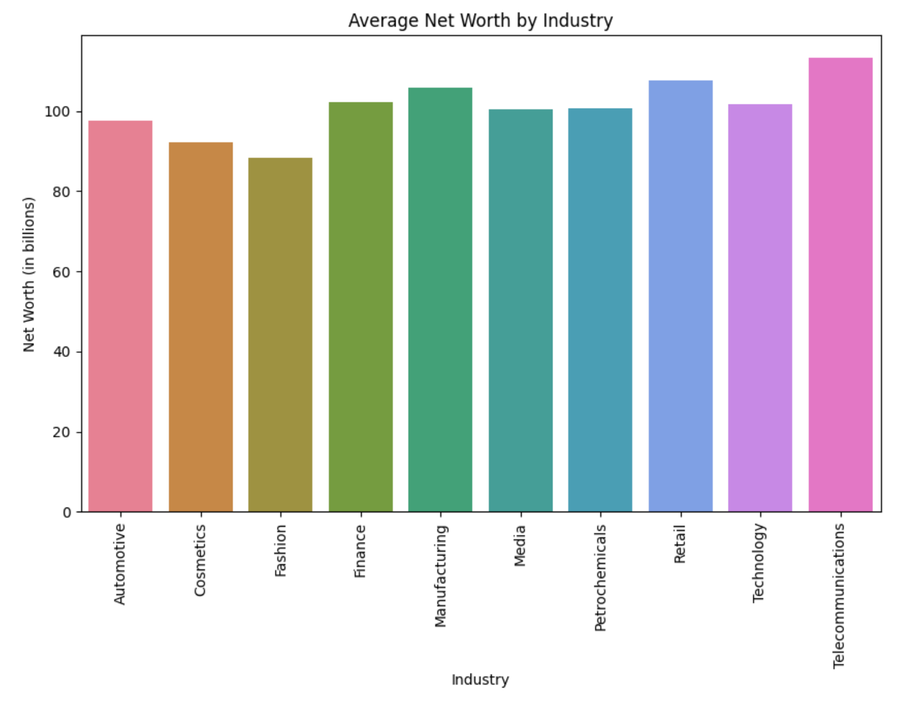

# IDS706 Cloud-Hosted Notebook Data Manipulation

## Continuous Integration with GitHub Actions
[](https://github.com/Reby0217/ids706-miniProj9/actions/workflows/install.yml)
[](https://github.com/Reby0217/ids706-miniProj9/actions/workflows/lint.yml)
[](https://github.com/Reby0217/ids706-miniProj9/actions/workflows/format.yml)
[](https://github.com/Reby0217/ids706-miniProj9/actions/workflows/test.yml)

This project demonstrates data manipulation tasks on a dataset of the 1000 wealthiest people globally, implemented in a cloud-hosted Jupyter Notebook on Google Colab. It includes a CI/CD pipeline set up with GitHub Actions to automate testing, linting, formatting, and dependency management.

---

## Deliverables

### Cloud-Hosted Notebook 
- **Link**: [Google Colab Notebook](https://colab.research.google.com/drive/1v6sNPN7wJbcJg73e6Op9bh9jjJ_No1zH) <a href="https://colab.research.google.com/github/Reby0217/ids706-miniProj9/blob/main/src/colab_proj.ipynb" target="_parent"></a> 

### Data Manipulation Tasks Performed

The following tasks were performed in the Google Colab notebook to analyze the dataset of the 1000 wealthiest people:

1. **Environment Setup**:
   - Uploaded `cli.py`, `lib.py`, and `Top_1000_wealthiest_people.csv` to the Colab environment. This allows for immediate access to the dataset and custom functions without needing Google Drive.
   - Imported essential libraries and custom functions from lib.py to streamline data processing and analysis.
   - 

2. **Data Loading**:
   - **Function**: `read_data(filepath)`
   - Loaded the dataset into a pandas DataFrame.
   - **Output**: Displayed the first few rows to verify data structure.

3. **Data Validation**:
   - **Function**: `validate_dataframe(df, required_columns)`
   - Checked for critical columns and non-empty data.
   - **Output**: Ensured data integrity by raising errors if required columns were missing.

4. **Descriptive Statistics Calculation**:
   - **Function**: `get_descriptive_statistics(df)`
   - Computed summary statistics for 'Net Worth (in billions)'.
   - **Output**: Table summarizing mean, median, standard deviation, etc.

5. **Grouping and Aggregation by Industry**:
   - **Function**: `get_industry_avg_net_worth(df)`
   - Calculated average net worth for each industry.
   - **Output**: Table showing average net worth by industry.

6. **Skewness and Kurtosis Calculation**:
   - **Function**: `calculate_skewness_kurtosis(df)`
   - Calculated skewness (asymmetry) and kurtosis (tailedness) for net worth.
   - **Output**: Skewness and kurtosis values to assess distribution shape.

7. **Data Visualization**:
   - **Bar Plot of Average Net Worth by Industry**:
     - **Function**: `plot_industry_avg_net_worth(industry_avg)`
     - Displayed average net worth by industry in a bar plot.
   - **Box Plot of Net Worth Distribution by Industry**:
     - **Function**: `plot_net_worth_distribution_by_industry(df)`
     - Showed wealth distribution within each industry using a box plot.

8. **Analysis Summary**:
   - Interpreted findings, noting average net worth and distribution characteristics.
   - **Insights**:
     - High average net worth in sectors like Telecommunications and Retail, with lower values in Fashion and Cosmetics.
     - Mostly symmetrical wealth distribution, with some variance among industries.


---


## Getting Started

### Prerequisites

- Python 3.9+
- `pip` for managing dependencies

### Installation

1. Clone the repository:

   ```bash
   git clone https://github.com/Reby0217/ids706-miniProj9.git
   cd ids706-miniProj9
   ```

2. Create and activate a virtual environment:

   ```bash
   python3 -m venv venv
   source venv/bin/activate 
   ```

3. Install dependencies:

   ```bash
   make install
   ```

### Running Tests

To run all tests (for both the notebook and the scripts):

```bash
make test
```

---

## Makefile

The project uses a `Makefile` to streamline development tasks, including testing, formatting, linting, and installing dependencies. Key Makefile commands:

- **Test**: Runs tests for the notebook.
  ```bash
  make test
  ```
  
- **Format**: Formats all Python files using `black`.
  ```bash
  make format
  ```

- **Lint**: Checks the code quality using `Ruff`.
  ```bash
  make lint
  ```

- **Install**: Installs all required dependencies from `requirements.txt`.
  ```bash
  make install
  ```

- **All**: Runs all major tasks (`install`, `setup`, `lint`, `test`, and `format`) in one command.
  ```bash
  make all
  ```


## Data Sample


## Descriptive Statistics


### Skewness and Kurtosis of Net Worth Distribution


### Average Net Worth by Industry


## Bar Plot: Average Net Worth by Industry


## Box Plot: Net Worth Distribution by Industry

